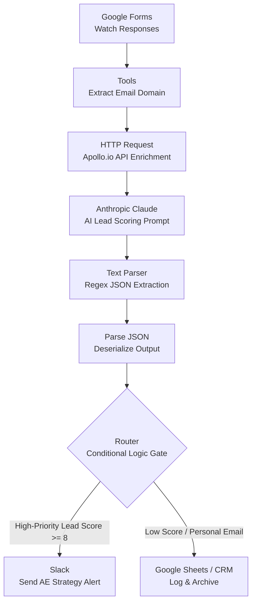

# Inbound Lead Enrichment & AI Scoring Pipeline

## 🎯 System Overview
This automated architecture is engineered to empower the sales team by instantly identifying and routing the highest-value inbound leads. The pipeline intercepts new form submissions, enriches the firmographic data using Apollo.io, and leverages Anthropic's Claude AI to evaluate the true potential of the account. 

While the system automatically filters out junk data and catches "hidden enterprises," its primary business goal is pure sales enablement: ensuring Account Executives spend their time prioritizing and attacking the most lucrative opportunities without doing manual research.

## 🔀 Architectural Diagram



## 🛠️ Step-by-Step Module Logic

### 1. Trigger & Text Processing
*   **Google Forms (Watch Responses):** Listens for new form submissions in real-time, capturing the lead's Full Name, Email Address, and self-reported Company Size.
*   **Tools (Set Variable):** Extracts the company domain from the lead's email address. It uses a split formula (e.g., `get(split(2. Respondent Email; @); 2)`) to strip away the user's name, isolating the domain (e.g., `apple.com`) to prepare for API enrichment.

### 2. Data Enrichment & AI Evaluation
*   **HTTP (Make a request):** Calls the Apollo.io API endpoint (`/api/v1/organizations/enrich`) via a GET request using the extracted domain. It retrieves real-world firmographic data, focusing on the true `estimated_num_employees`.
*   **Anthropic Claude (Create a Prompt):** Acts as the AI Lead Scorer. A strict system prompt feeds Claude both the self-reported form data and the enriched Apollo data. Claude compares the two to detect high-intent leads or discrepancies. It outputs a raw JSON payload containing three keys: `fit_score` (1-10), `is_hidden_enterprise` (boolean), and `reasoning` (a short strategy note).

### 3. Data Sanitization & Deserialization
*   **Text Parser (Match Pattern):** Cleans the AI's output to guarantee strict JSON formatting. Because LLMs often wrap outputs in markdown (e.g., ` ```json `), this module uses the Non-Greedy Regex pattern `\{[\s\S]*?\}` to extract only the raw JSON object, preventing downstream DataError crashes.
*   **JSON (Parse JSON):** Converts the regex-cleaned JSON string into mappable variables, turning the `fit_score`, `is_hidden_enterprise`, and `reasoning` into usable data pills.

### 4. Routing & Notification
*   **Router:** Acts as the gatekeeper. It checks the AI's `fit_score`.
*   **High-Priority Pathway (Slack):** If the score meets the threshold (e.g., >= 8), the data passes through. Slack formats a clean alert combining the original form data, the true Apollo headcount, and the AI's strategy reasoning for the Account Executive.
*   **Standard Pathway (Sheets/CRM):** If the score is low, the flow routes the raw data into a Google Sheet or CRM for standard marketing nurture, keeping the sales channel pristine.

## 🛡️ Key Edge Cases Handled

*   **The "Hidden Enterprise" Scenario:** If a massive company submits a form using a small company size bracket (e.g., claiming 1-99 employees when they have 5,000+), the Apollo HTTP module reveals the truth. Claude is prompted to flag this discrepancy and boost the score, bypassing the user's incorrect input.
*   **LLM Hallucinations on Empty Data:** If a user submits a personal email (like `@gmail.com`), Apollo returns a 200 Success but with an empty organizational payload. Claude recognizes the lack of corporate data, scores it low, and the Router filters it out to the CRM archive.
*   **Syntax Reliability:** The implementation of the regex Text Parser guarantees the pipeline is bulletproof against AI formatting anomalies, ensuring the JSON parser never breaks due to conversational text or markdown artifacts.
